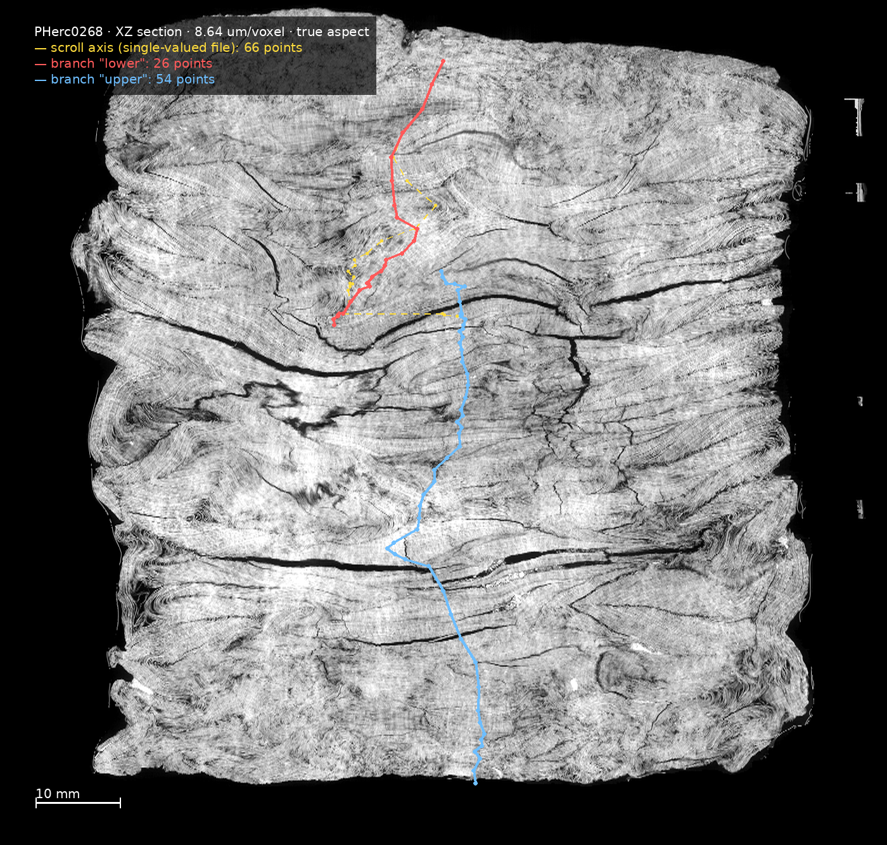
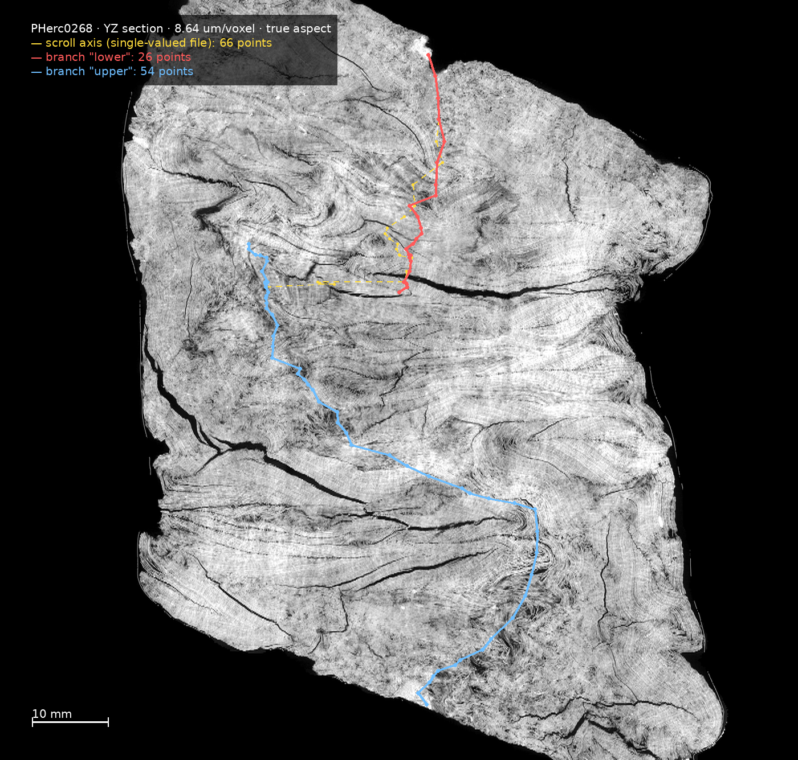
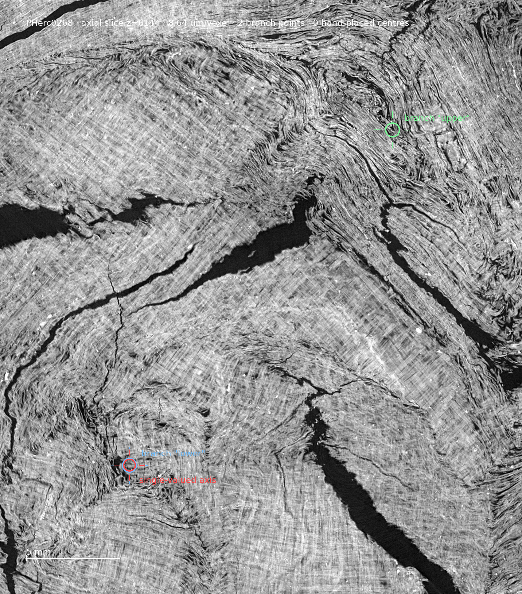
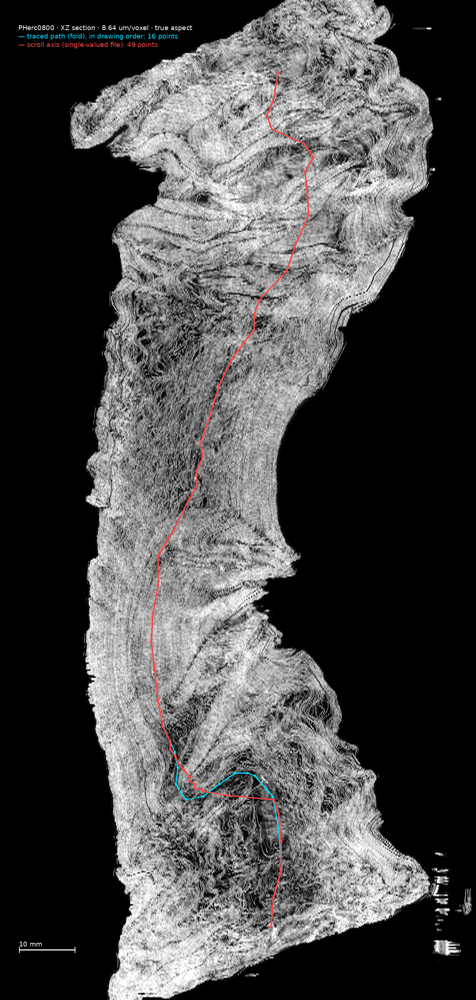
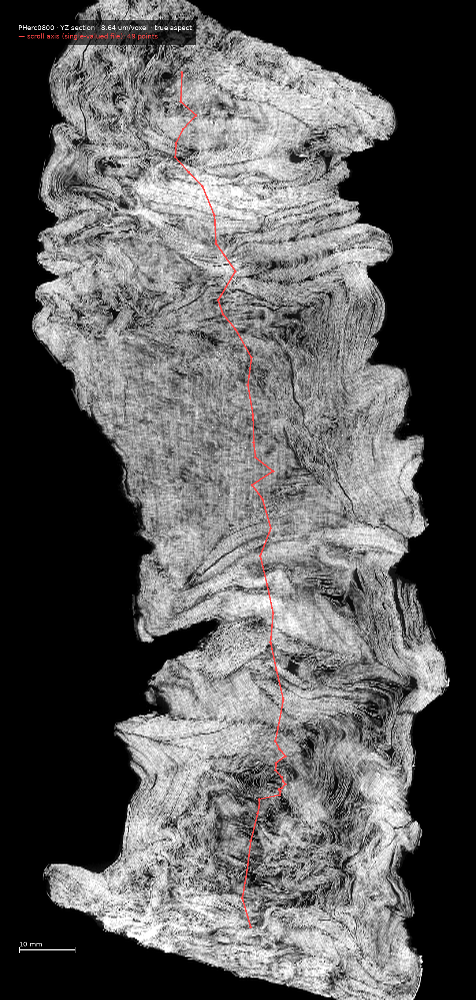
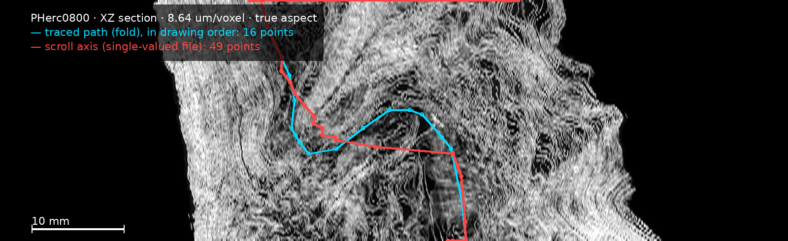
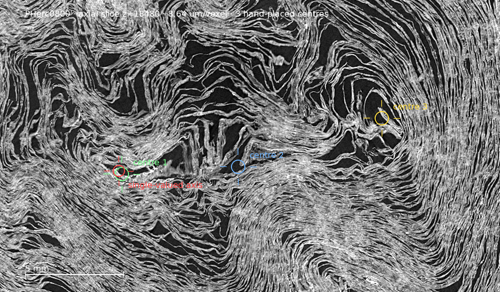
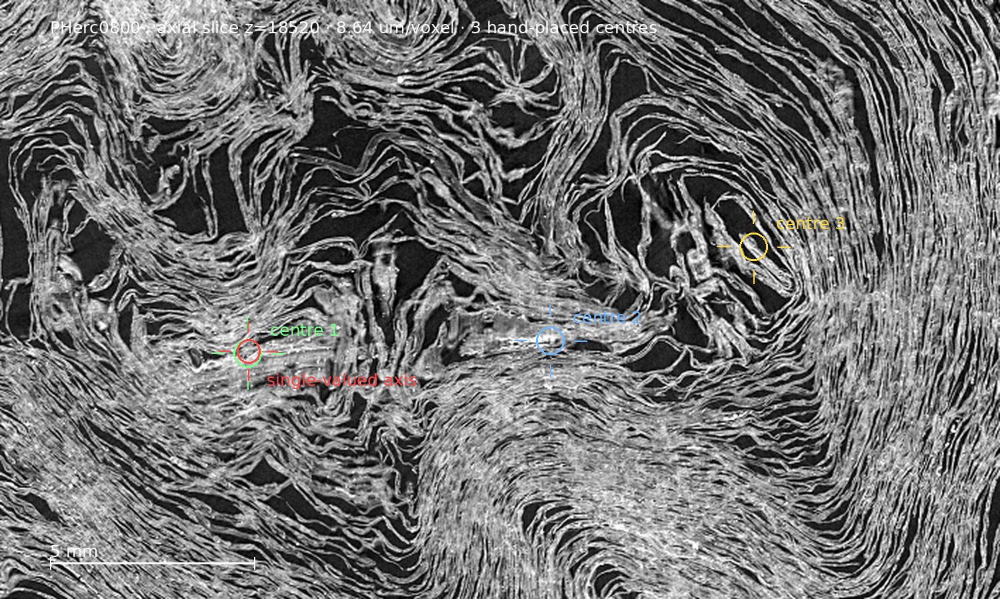

# Where one centre per height is not enough

*Companion page to the umbilicus annotations. Every figure here is generated by a
script from the published annotation files — `scripts/fig_axis.py` for the side
views, `scripts/fig_slice.py` for the axial ones. None was assembled by hand.
Aspect ratios are true (recomputed in microns), and each figure carries its own
scale bar so the reader can measure rather than trust.*

An umbilicus is currently a function of height: one control point per z, and
every consumer reads the file as z → (x, y). Two of the ten First Letters scrolls
break that assumption, and they break it in two different ways. That difference
is the point of this page: a single extension has to cover both.

---

## 1. PHerc0268 — two axes that never join

XZ section, field 105 × 100 mm. Red is the lower branch (26 points), blue the
upper (54). The yellow dashed line is the ordinary single-valued file for the
whole scroll; it is drawn dashed so that it does not cover the branches, and the
**sideways sweep on it at the split is not a drawing artefact** — it is what the
single-valued form is forced to do: step from one branch to the other in a single
slice.

The same scroll seen from the other side. The split is present in both
projections, so it is a property of the material and not of the viewpoint.

Axial slice z = 6144, one of the **thirteen** heights where both branches are
annotated. They are 22.8 mm apart here; across all thirteen the separation stays
between 21.9 and 24.3 mm, so the two run in parallel and do not converge. Each
sits in its own convergence of laminae. The red marker is the single-valued
file's point: it lies on one of the two centres and is silent about the other.

Annotated as branches: `PHerc0268/branch_lower_umbilicus.json` (26 points,
z 2680–6312) and `PHerc0268/branch_upper_umbilicus.json` (54 points, z 5560–12584). This is the case the additive
`branches` key was proposed for.

## 2. PHerc0800 — one axis that doubles back

The other kind is not a split at all.

The whole scroll first, both sections, so the reader can see where on its 179 mm
of height the affected band lies and that the axis is single elsewhere. The band
sits at roughly 158–160 mm, near the top.

The same band enlarged: heights 145.2–171.1 mm, field 85 × 26 mm. On the whole
scroll this region is one and a half per cent of the picture and cannot be read
at all, hence the crop. Red is the axis; **cyan is the path traced by hand on the
side view, drawn in the order it was traced** — it runs up, comes back, and runs
up again. That return is what the single-valued form cannot express.

Axial slices z = 18480 and z = 18520: **three hand-placed centres on each**, every
one of them in its own convergence of laminae. Two heights are shown so that it
is clear the three are not an accident of one slice. In all, three centres were
placed by hand on **six heights between z 18260 and z 18632** — 3.21 mm of
height, 18 points — and a seventh height, z 18408, carries two placed centres
beside two crossings that were never moved off the cut plane and are labelled as
such. Measured on those six heights, neighbouring centres stand 1.6–9.1 mm apart
(median 6.7 mm) and the three together span 9.0–13.6 mm (median 12.7 mm). The red
marker is again the single-valued axis, sitting on one of the three.

The consequence is not cosmetic. Put those 18 points into one single-valued file
and sort them by z, which is what every reader does: 15 of the 17 consecutive
steps then jump more than 5 mm sideways, the largest of them 12.8 mm, and every
reader we know of joins those points with a straight segment — through papyrus,
without a warning. The three tracks are individually
smooth: sorted by x they move by 2.2, 4.2 and 2.3 voxels per voxel of height at
worst, so the jump is an artefact of the representation, not of the annotation.

## 3. Why the two cases need different things

On PHerc0268 the two centres are strangers: no path connects them, and each owns
its own band of heights. On PHerc0800 there is **one continuous path**, traceable
point by point through every annotated height — it simply is not a function of z
over 3.21 mm of its length.

Branches describe the first case and say nothing useful about the second.
Explicit succession describes the second and is redundant for the first. An
extension worth agreeing on has to hold both.

**What is in this repository, and what is not.** `PHerc0800_umbilicus.json` is
unchanged and remains valid outside that band; inside it, it necessarily follows
one of the three centres and is wrong about the other two. The three-centre
annotation is published beside it as per-slice point lists
(`PHerc0800/axis_z*.json`, nine heights), together with cracks marked in the same
plane on two of those heights (`PHerc0800/crack_z*.json`, nine cracks). Nothing in the established format
can express either, which is the point of this page.

**Three directions, in order of how additive they are.**

1. **Explicit succession** — store the axis as an ordered path, this point
   continues into that one, instead of recovering the order by sorting on z.
   Sorting is what turns a returning path into an interleaved zig-zag, and the
   loss is silent.
2. **The `branches` key** already proposed for multi-axis scrolls, with an
   explicit z range per branch, so more than one centre can live in one file
   without breaking any existing reader.
3. **A file being able to declare the range where the single-valued form does not
   hold**, so that a consumer can refuse rather than interpolate through papyrus.

**Two questions we would like answered before proposing a shape.** Has anyone
seen more than one winding centre on a single slice in another scroll? And would
an additive extension along these lines be acceptable, or is there a preferred
form for it?

## Reproducing the figures

The two scripts read the working annotation tree, which holds the slice images
the axial figures are drawn on; those images are not in this repository because
of their size. Point the scripts at that tree with `UMB_ROOT`:

    export UMB_ROOT=/path/to/annotation/tree
    python3 scripts/fig_axis.py  PHerc0268 both
    python3 scripts/fig_axis.py  PHerc0800 xz --zrange 16800 19800
    python3 scripts/fig_slice.py PHerc0800 18480
    python3 scripts/fig_slice.py PHerc0268 6144

A note on the axial figures: a point placed by hand is distinguished from an
untouched crossing of the side-view line by whether it still lies exactly on the
cut plane. A crossing is born on that plane; a human placing it into the centre
of a whorl necessarily moves it off. The figures label the two differently, and
untouched crossings are drawn faintly and named as such.
